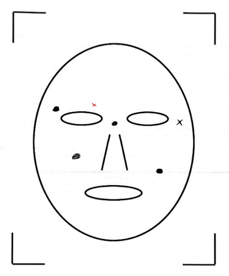
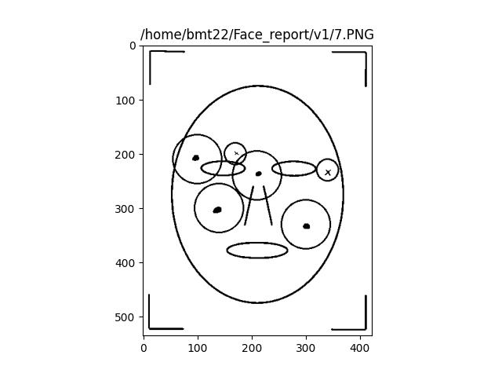

# An automated way to get insights from face pictures

In a previous job, I had to go through a consequent amount of files to get some information. This meant opening pdf or other formats one after another to go to a specific schema and note what might be noted on it. This is truly time consumming.

As I got more and more used to work with Python, I wanted to develop an algorithm able to automate this task. For this project, I decided to work on extracting insights from face schemas (for instance annotations such as circles and cross) since it is quite general and could be of use to someone reading this.

The algorithm should perform the following tasks:
-   go over the files in a given repository,
-   extract the images in those files,
-   compare them with a model to keep only the information needed,
-   crop, reshape and process the resulting images to analyze and compile the insights,
-   offer an overview of the data,
-   store the results.

## V1:
The actual version of the code is only working to extract insights from png images in a repository.
A new version will be realesed to work with pdf.

Here is a sample of the current result: (Circles are circled with a larger radius than cross)
| Before analysis | After analysis |
| ----------- | ----------- |
|  |  |

**Potential issues anticipated so far**:
- A bad scan prevent a good cropping. In those cases it is detected by the program.
- A blank page or schema without annotations is anticipated and also reported in the csv file.
- Rotated images are skipped by the program, a technique to deal with it is currently tested.
- Circles are sometime difficult to distinguished from cross or other shapes. A bad drawing may be an issue.

**How to use the code**:
- Before executing the code you should:
    - Put your input images in the v1 folder as png.
    - Have your model image in the Reference folder.
    - Have an empty Analysis_report folder.
- What you get after executing the code:
    - A csv file (cross_circles_coord.csv) with each file id with its original name from v1 folder, the coordinates of each annotation an image has and its type, and a message explaining if nothing was extracted from an image.
    - An image (Compilation.jpeg) with the visual compilation of all cross on one face and all circles on another.
    - The execution time in the terminal.

**PS:** The program is still under development. I intend to make it more efficient, cleaner and add a sharing feature.
